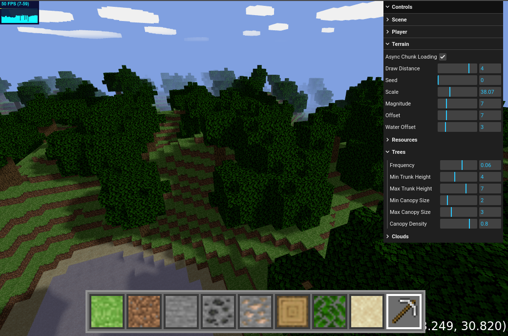
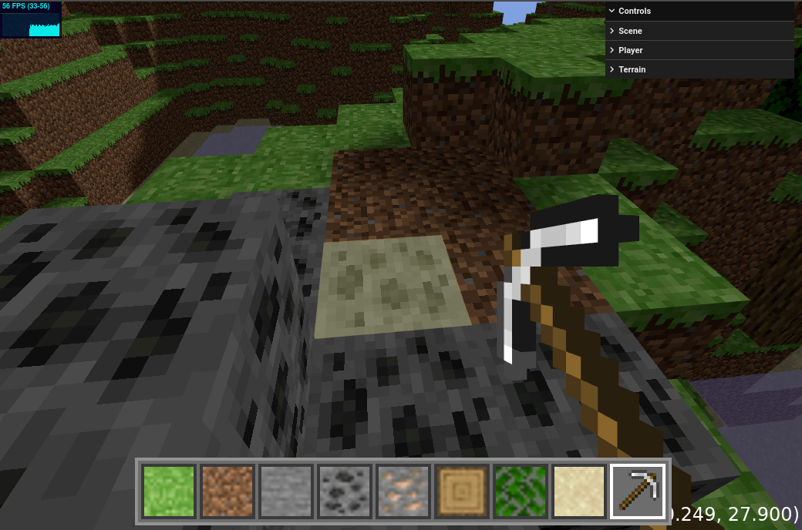

## Blockgame written with three.js 

### Assets not included 

Made following the tutorial by SimonDev https://github.com/simondevyoutube/Quick_MinecraftClone2 

This is small and simple codebase, has decent coverage of three features and common patterns and results in a playable game, with opportunities for improvements and optimization. I'd like to do an input controller, buffer meshes rather than instancing, transparent blocks, a water shader 

A good learning experience and refresher for JS and oop, it's been a few years 

I've run into issues generating a Buffer mesh, I'll move on for now while I've got momentum 

#### Controls 

- WASD for movement
- Space to jump
- Left click to mine / place 
- 1 through 8 to select a block
- 0 to select pickaxe 
- F1 to save to browser localStorage 
- F2 to load 

